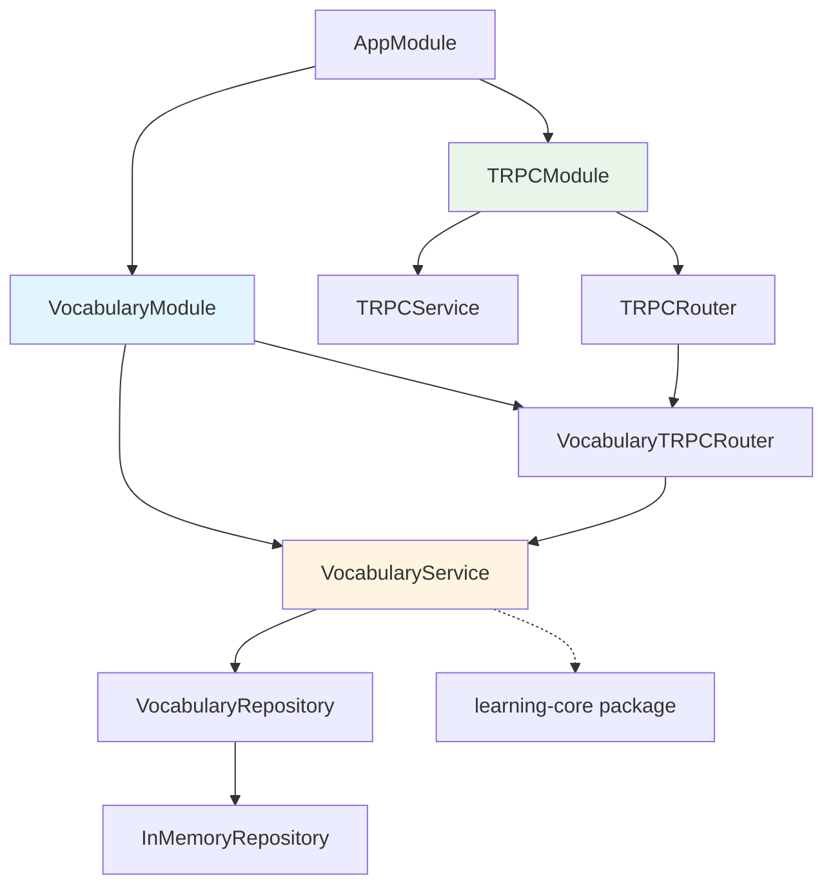

---
name: English Learning Backend Modules
overview: Plan backend module architecture for English learning app, implement Vocabulary module (most crucial) with TRPCModule integration, leveraging existing learning-core package types.
todos:
  - id: create-vocabulary-module
    content: Create VocabularyModule with service, TRPC router, and DTOs
    status: completed
  - id: create-trpc-module
    content: Create TRPCModule with service and main router setup
    status: completed
  - id: create-repository-pattern
    content: Create VocabularyRepository interface and InMemoryRepository implementation
    status: completed
  - id: integrate-modules
    content: Integrate VocabularyModule and TRPCModule into AppModule
    status: completed
    dependencies:
      - create-vocabulary-module
      - create-trpc-module
  - id: add-trpc-routes
    content: Add TRPC HTTP endpoint in main.ts (Express adapter)
    status: completed
    dependencies:
      - create-trpc-module
---

# English Learning Backend - Module Architecture & Vocabulary Implementation

## Overview

Plan and implement backend modules for an English learning application. The Vocabulary module is chosen as the most crucial functionality since it's the foundation for all learning activities.

## Backend Module Architecture

The backend will be organized into the following modules:

1. **VocabularyModule** (most crucial - to be implemented)

- Word CRUD operations
- Mark words as learned
- Track practice sessions
- Get words needing practice

2. **LessonModule** (future)

- Lesson CRUD operations
- Lesson completion tracking
- Score tracking

3. **StatisticsModule** (future)

- Calculate learning statistics
- Streak tracking
- Progress metrics

4. **ActivityModule** (future)

- Daily activity tracking
- Practice time logging

5. **TRPCModule** (infrastructure)

- TRPC router setup
- Procedure definitions
- Error handling

## Implementation Plan

### 1. Vocabulary Module Structure

Create the Vocabulary module with the following structure:

```javascript
apps/backend/src/
├── vocabulary/
│   ├── vocabulary.module.ts          # NestJS module
│   ├── vocabulary.service.ts          # Business logic
│   ├── vocabulary.controller.ts       # HTTP controller (optional, TRPC primary)
│   └── vocabulary.trpc.ts             # TRPC router with procedures
├── trpc/
│   ├── trpc.module.ts                 # TRPCModule setup
│   ├── trpc.service.ts                # TRPC context/service
│   └── trpc.router.ts                 # Main app router
└── app.module.ts                      # Root module
```


### 2. Vocabulary Module Implementation

**VocabularyService** (`vocabulary/vocabulary.service.ts`):

- `createWord(word: CreateWordDto): Promise<Word>`
- `getWordById(id: string): Promise<Word | null>`
- `getAllWords(): Promise<Word[]>`
- `updateWord(id: string, data: UpdateWordDto): Promise<Word>`
- `deleteWord(id: string): Promise<void>`
- `markAsLearned(id: string): Promise<Word>`
- `recordPractice(id: string): Promise<Word>`
- `getWordsNeedingPractice(days?: number): Promise<Word[]>`

**VocabularyTRPCRouter** (`vocabulary/vocabulary.trpc.ts`):

- `vocabulary.create` - mutation to create a word
- `vocabulary.getById` - query to get word by ID
- `vocabulary.getAll` - query to get all words
- `vocabulary.update` - mutation to update a word
- `vocabulary.delete` - mutation to delete a word
- `vocabulary.markLearned` - mutation to mark word as learned
- `vocabulary.recordPractice` - mutation to record practice session
- `vocabulary.getNeedingPractice` - query to get words needing practice

### 3. TRPCModule Setup

**TRPCModule** (`trpc/trpc.module.ts`):

- Configure TRPC router
- Export TRPC service
- Import VocabularyModule

**TRPCRouter** (`trpc/trpc.router.ts`):

- Create main app router
- Merge vocabulary router
- Export AppRouter type for frontend

**TRPCService** (`trpc/trpc.service.ts`):

- Initialize TRPC context
- Create tRPC instance
- Handle errors

### 4. Database Integration

Since you'll configure the database yourself:

- VocabularyService will use a repository pattern
- Create `VocabularyRepository` interface
- For now, implement in-memory repository
- Easy to swap for database repository later

### 5. DTOs and Validation

Create DTOs for Vocabulary operations:

- `CreateWordDto` - word, definition (required)
- `UpdateWordDto` - partial word updates
- Use Zod schemas for TRPC input validation (aligned with TRPC best practices)

### 6. Integration with learning-core Package

- Import types from `@repo/learning-core` (Word, LearningStats, etc.)
- Use `getWordsNeedingPractice` from learning-core for practice recommendations
- Statistics calculations will use learning-core functions

## Files to Create/Modify

### New Files:

- `apps/backend/src/vocabulary/vocabulary.module.ts`
- `apps/backend/src/vocabulary/vocabulary.service.ts`
- `apps/backend/src/vocabulary/vocabulary.trpc.ts`
- `apps/backend/src/vocabulary/dto/create-word.dto.ts`
- `apps/backend/src/vocabulary/dto/update-word.dto.ts`
- `apps/backend/src/vocabulary/repositories/vocabulary.repository.ts`
- `apps/backend/src/vocabulary/repositories/in-memory-vocabulary.repository.ts`
- `apps/backend/src/trpc/trpc.module.ts`
- `apps/backend/src/trpc/trpc.service.ts`
- `apps/backend/src/trpc/trpc.router.ts`

### Modified Files:

- `apps/backend/src/app.module.ts` - Import TRPCModule and VocabularyModule

## Dependencies to Add

You'll need to install (you mentioned you'll configure TRPC):

- `@trpc/server` - TRPC server
- `zod` - Schema validation for TRPC
- Database client (when you configure database)

## Architecture Diagram




## Next Steps After Implementation